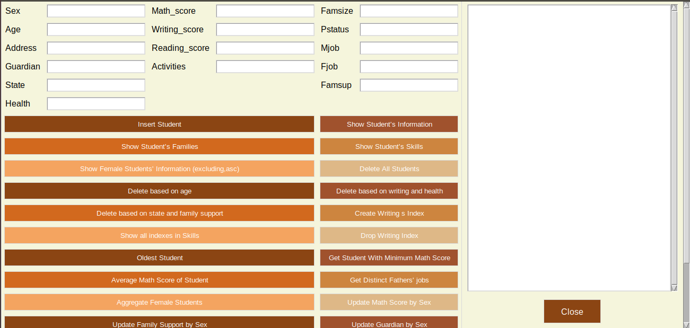

# Student Performance Project

Welcome to the Student Performance Project! This project is designed to analyze student performance data using a graphical user interface (GUI) built with Python and MongoDB. The data is read from a JSON file and organized into multiple collections in the database. The GUI allows users to insert data and execute various queries.

## Table of Contents
- [Introduction](#introduction)
- [Features](#features)
- [Technologies Used](#technologies-used)
- [Installation](#installation)
- [Usage](#usage)
- [GUI Screenshot](#gui-screenshot)
- [License](#license)

## Introduction
The Student Performance Project is a tool for managing and analyzing student performance data. It reads student data from a JSON file, stores it in a MongoDB database, and provides a user-friendly GUI for data manipulation and querying.

## Features
- Read student performance data from a JSON file
- Store data in multiple MongoDB collections
- GUI to:
  - Insert new student data
  - Execute 25 different queries on the data

## Technologies Used
- **Backend:** Python
- **Database:** MongoDB
- **GUI:** Tkinter 

## Installation
To set up the project locally, follow these steps:

1. Clone the repository:
    ```
    git clone https://github.com/Aisha-Hassan1/student-performance.git
    ```
2. Navigate to the project directory:
    ```
    cd student-performance
    ```
3. Set up your MongoDB database and ensure it's running.
4. Load the JSON data into MongoDB:

5. Run the GUI application:
    ```
    Student Performance Group.ipynb
    ```

## Usage
1. Open the application:
2. Use the GUI to insert new student data or execute various queries.

## GUI Screenshot
Here's a screenshot of the GUI to give you an idea of what the application looks like:




## License
This project is licensed under the MIT License. 

---

Thank you for exploring the Student Performance Project! We hope it provides a useful tool for managing and analyzing student data. If you have any questions or feedback, feel free to reach out.
